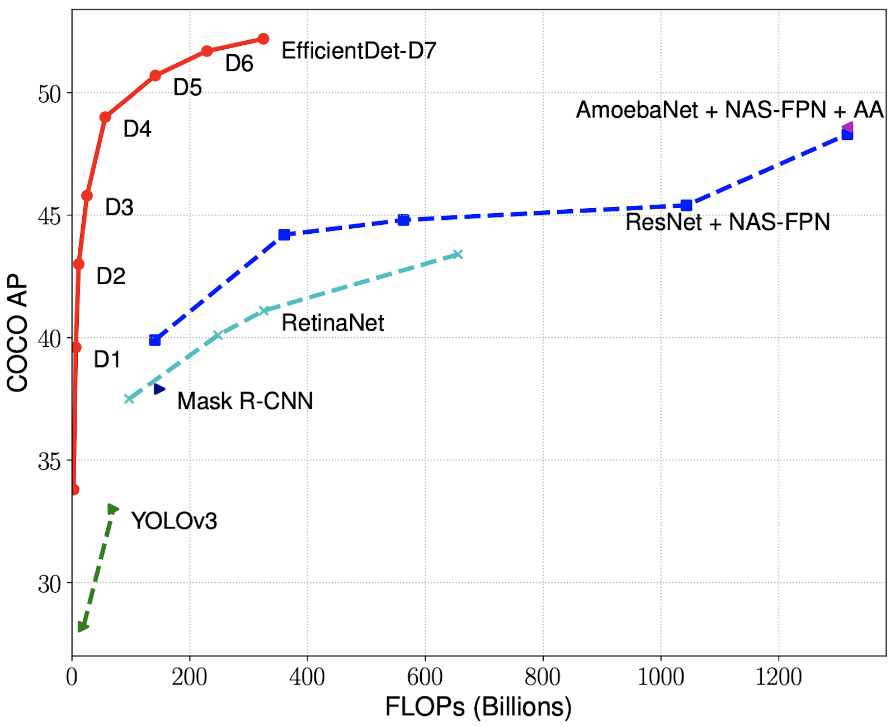

# **EfficientDet-Pipeline**

## 👋 **Introduction**
A Pytorch full pipeline (training and inference) for [EfficientDet](https://arxiv.org/abs/1911.09070). Easily adapt to custom data.\
This pipeline is based on the [efficientdet-pytorch](https://github.com/rwightman/efficientdet-pytorch) implementation of rwightman.

## 🚀 **Quick Start**
How to train on your custom data? For example, I will use the [VinDrCXR](https://www.kaggle.com/c/vinbigdata-chest-xray-abnormalities-detection) dataset.

### **1. Create dataset.yaml**
[data/VinDrCXR/vindrcxr.yaml](data/VinDrCXR/vindrcxr.yaml), shown below, is the dataset config file that defines:
- absolute paths to `train` / `val` / `test` image directories and annotation files.
- the number of classes `num_classes`.
- a list of class names.
```bash

train_annotations_path: ../data/VinDrCXR/annotations/full_union_train.json
val_annotations_path: ../data/VinDrCXR/annotations/full_union_val.json
train_images_path: ../data/VinDrCXR/images/train
val_images_path: ../data/VinDrCXR/images/val
test_images_path: ../data/VinDrCXR/images/test

num_classes: 14
class_names: [
  "Aortic enlargement", 
  "Atelectasis", 
  "Calcification", 
  "Cardiomegaly", 
  "Consolidation", 
  "ILD", 
  "Infiltration", 
  "Lung Opacity", 
  "Nodule/Mass", 
  "Other lesion", 
  "Pleural effusion", 
  "Pleural thickening", 
  "Pneumothorax", 
  "Pulmonary fibrosis", 
]
```

### **2. Organize annotations**
Organize your `train` / `val` / `test` annotation files to the dictionary format, with one `*.json` file per set. The `*.json` file specifications are:
- One item per image
- Each item is a list of sub-dictionaries, one sub-dictionary per object
- Each sub-dictionary contains `"bbox"` in `x_min`, `y_min`, `x_max`, `y_max` format, and `"cls"`, which starts from 1.

### **3. Select a EfficientNet backbone**
Define a pretrained EfficientDet `d*` model by selecting the corresponding EfficientNet `b*` backbone.
> 

### **4. Put hyperparameters in the config file**
[source/hyps.yaml](source/hyps.yaml), shown below, is the hyperparameters config file:
```bash

device: "cuda"
num_workers: 4
batch_size: 6
backbone_name: "tf_efficientnet_b3"
image_size: 768
lr: 3e-4
epochs: 30
conf_threshold: 1e-4
iou_threshold: 0.4
ckps_path: "../ckps"
```

### **5. Run**

Main commands:
```bash
cd source/

# Train
python train.py --data_file "../data/VinDrCXR/vindrcxr.yaml" --hyps_file "hyps.yaml"
# Test
python test.py --data_file "../data/VinDrCXR/vindrcxr.yaml" --hyps_file "hyps.yaml"
```

For inference:
```bash
python detect.py --data_file "../data/VinDrCXR/vindrcxr.yaml"\
--basic_config_path "../ckps/tf_efficientdet_d3.json" --ckp_path "../ckps/tf_efficientdet_d3.pt" --device "cuda"\
--conf_threshold 1e-4\
--iou_threshold 0.4\
--detect_path "../ckps/detect"\
```